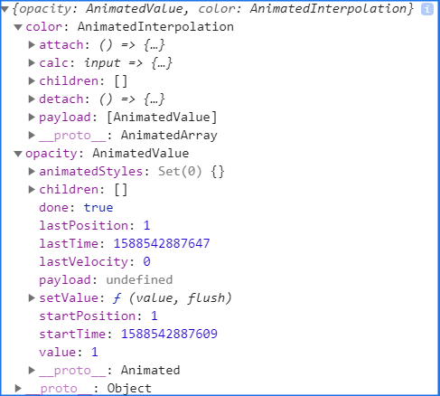
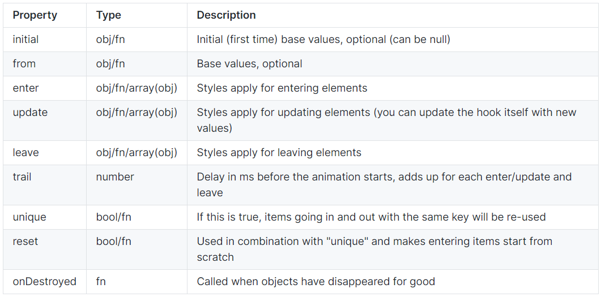

# React Spring Chained UI Animation

Contents
- Overview
- Live Site
- Installation
- Documentation
- Resources / Contact Info

## Overview

React-Spring is a spring based animation library. Since the animations are spring based and not duration based, UI elements move more naturally.

An example of this is the UI component in [this](https://codesandbox.io/embed/2v716k56pr) demo code sandbox from the official documentation. It moves fluidly and is a good way to convey grid-like content.

In this document I'll provide documentation for how that code sandbox demo works. The React-Spring documentation is a little unfriendly to new web devs/hackers so I want to give a more in depth explanation of the code to help people out (read: myself). Also, code sandbox is trash and trying to use their editor to play with code is basically impossible.

[Here](https://www.react-spring.io/docs/hooks/use-chain) is the page in the official React-Spring docs where this demo is shown.

The demo is a good UI component to know how to use. It provides white space emphasizing a title or call to action and smoothly transitions the user to some content related to that.

If you want to avoid clutter on your page but also want to include a grid of content like blog posts you can use this component to accomplish that in an efficient and stylish way.

## Live Site

https://codesandbox.io/embed/2v716k56pr

## Installation

These steps assume you have [Node.js](https://nodejs.org/en/) installed on your computer.

1. Create local directory for the project to live in
2. Download the files into that directory
3. Use a [cli](https://www.w3schools.com/whatis/whatis_cli.asp) and navigate into that directory
4. Use `npm install` to download the necessary node modules
5. Use `npm start` to launch the server

## Documentation

The hook used to accomplish this demo is the `useChain` hook. This hook allows you to chain multiple different animations in a row.

This demo chains together an animation from the `useSpring` hook and an animation from the `useTransition` hook. In order for a chain to work, each animation must have a ref passed along to it to block it from starting on its own.

If the hook `useRef` is unfamiliar to you, check out the [documentation](https://reactjs.org/docs/hooks-reference.html#useref) on React.js's site. It's a core hook that's a part of React.js and not the React-Spring libary. 

**useSpring**

A `useSpring` hook simply animates a value. You can animate numbers, strings, and more. The `useSpring` hook in the demo's chain fires first and animates the container element to change color from pink to white and the size of the container element to go from 20% to 100%.

Before diving into the demo's use of `useSpring`, look at one of the simplest examples of how to use the `useSpring` hook from the [official documentation](https://www.react-spring.io/docs/hooks/use-spring). It'll help if you've never worked with this library before.

_official docs_
```
// This ...
const props = useSpring({opacity: 1, color: 'red'})
// is a shortcut for this ...
const props = useSpring({to: {opacity: 1, color: 'red'}})
```

If you add `console.log(props)` to your code you should see something like this in the console:



The `useSpring` function returns an object where the keys are the names of the object key names passed to it, `opacity` and `color`. If you pass the `props` object to the `style` attribute in one of your component's elements it'll animate the opacity and color styles of that element.

The `useSpring` declaration in the `useChain` demo is a bit more involved than that example. If you don't recognize the variable declaration before `useSpring` since it differs from the code above it's a part of [ES6](https://www.sitepoint.com/es6-enhanced-object-literals/).

_index.js_
```
const [open, set] = useState(false)

const springRef = useRef()
const { size, opacity, ...rest } = useSpring({
    ref: springRef,
    config: config.stiff,
    from: { size: '20%', background: 'hotpink' },
    to: { size: open ? '100%' : '20%', background: open ? 'white' : 'hotpink' }
  })
```

Adding the following will show you what those are returning.

```
console.log(size, opacity, {...rest})
```

This use of `useSpring` comes with a ref, a config object, an object representing the styles the element starts the animation at before mounting, and an object representing the styles the element ends at after mounting. 

The `to` styles are conditional on the `open` variable set up using the `useState` hook. That variable is set to true when the component is open and false when it's closed. Since the component starts closed and the `open` variable is false, there is no mounting animation. The element's styles go from `{ size: 20%, background: 'hotpink' }` to `{ size: 20%, background: 'hotpink' }`. 

The config object `config` where `config.stiff` comes from is an object containing a bunch of presets. There's also `config.wobbly`, `config.gentle`, and [more](https://www.react-spring.io/docs/hooks/api). If you delete it the core of the animation will still work, it'll just be less stiff!

The other animation that is going to be chained with this `useSpring` animation is a transition animation that uses the hook `useTransition`.

**useTransition**

The `useTransition` hook animates properties when items are added or removed. Basically mounting and unmounting animations.

[Here](https://www.react-spring.io/docs/hooks/use-transition) is the official documentation for the `useTransition` hook.

The hook requires three arguments: an array of items to apply the animations to, the keys to apply to those items, and the animation specs represented as an object.

The animation specs cover the following:




In the demo this hook animates the colorful boxes within the container to change size and change opacity when they mount and unmount. There is a delay between each individual item going through the animation which gives it a nice little flair.

_index.js_
```
const transRef = useRef()
const transitions = useTransition(open ? data : [], item => item.name, {
    ref: transRef,
    unique: true,
    trail: 400 / data.length,
    from: { opacity: 0, transform: 'scale(0)' },
    enter: { opacity: 1, transform: 'scale(1)' },
    leave: { opacity: 0, transform: 'scale(0)' }
  })
```

The array of items to apply the animations to is located in the `data.js` file. The array that is exported from that file is imported into a variable named `data`.

_data.js_
```
export default [
  {
    name: 'Rare Wind',
    description: '#a8edea → #fed6e3',
    css: 'linear-gradient(135deg, #a8edea 0%, #fed6e3 100%)',
    height: 200
  },
  ...
]
```

The keys to apply to each element in the array is the name of each item since those are unique.

So now there are two animations to be chained together. The next section is how the hook `useChain` accomplishes that.

**useChain**

Now that there are two defined animations, they can be put together using `useChain`. 

_index.js_
```
 // This will orchestrate the two animations above, comment the last arg and it creates a sequence
 useChain(open ? [springRef, transRef] : [transRef, springRef], [0, open ? 0.1 : 0.6])
```


## Resources / Contact Info

